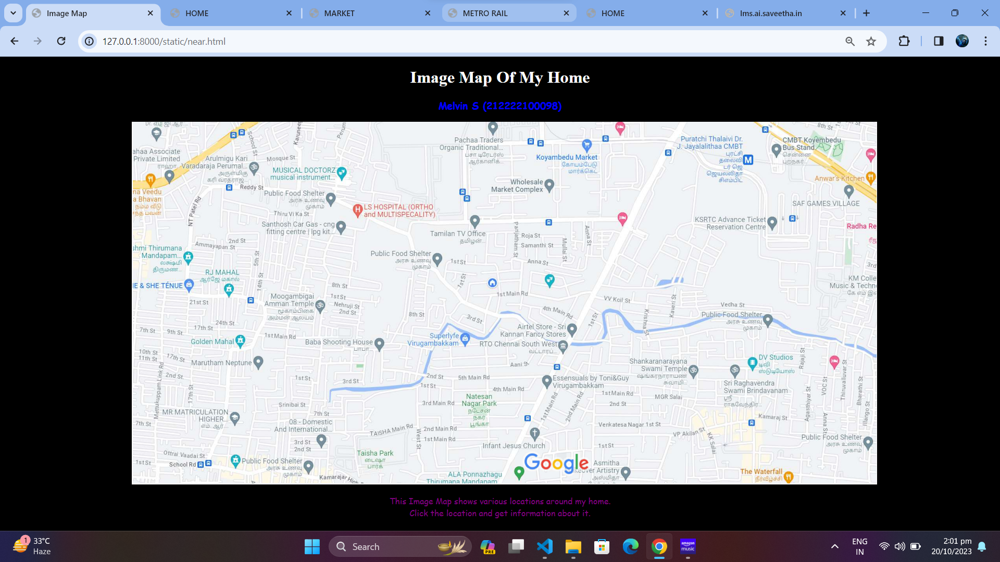
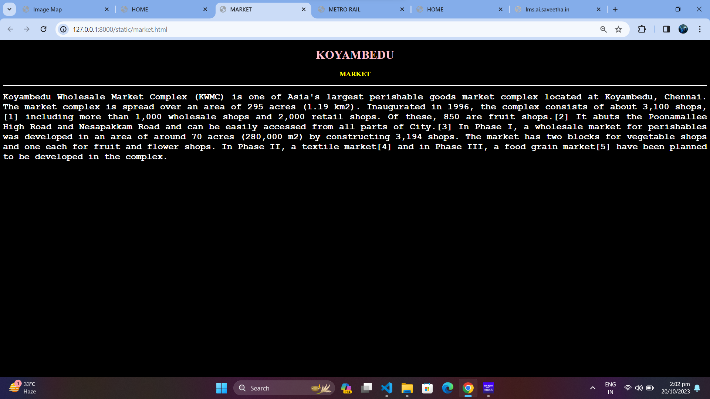
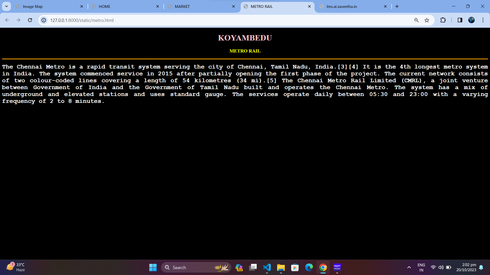
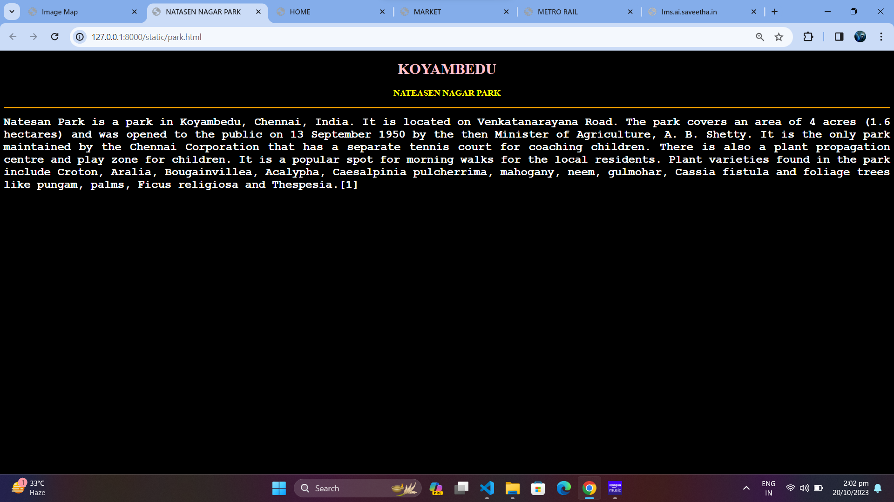

# Ex04 Places Around Me
## DATE:28.9.23

## AIM
To develop a website to display details about the places around my house.
## DESIGN STEPS

### STEP 1
Create a Django admin interface.

### STEP 2
Download your city map from Google.

### STEP 3
Using ```<map>``` tag name the map.

### STEP 4
Create clickable regions in the image using ```<area>``` tag.

### STEP 5
Write HTML programs for all the regions identified.

### STEP 6
Execute the programs and publish them.
## CODE
```
<!DOCTYPE html>
<html>
    <head>
        <title>
            Image Map
        </title>
    </head>
    <body bgcolor ="black">
        <h1 align="center" >
            <font color="white" >
                    Image Map Of My Home
            </font>
        </h1>
        <h3 align="center">
        <font color=" blue" face ="cursive">
            Melvin S (212222100098)
        </font>
            
        </h3>
        <center>
;l; <!-- Image Map Generated by http://www.image-map.net/ -->

<map name="image-map">
    <area target="_blank" alt="home" title="home" href="home.html" coords="649,284,737,343" shape="rect">
    <area target="_blank" alt="park" title="park" href="park.html" coords="622,517,711,596" shape="rect">
    <area target="_blank" alt="metro" title="metro" href="metro.html" coords="1046,28,1182,118" shape="rect">
    <area target="_blank" alt="market" title="market" href="market.html" coords="775,40,903,110" shape="rect">
</map>


        </center>
        <p align="center">
            <font color="purple"  face="Comic Sans MS" >
                This Image Map shows various locations around my home.<br>
                Click the location and get information about it.
            </font>
        </p>


    </body>
</html>


<!DOCTYPE html>
<html>
    <head>
        <title>
            HOME
        </title>

    </head>
    <body bgcolor ="black">
        <h1 align="center">
            <font color = "pink">
                <b>
                    KOYAMBEDU
                </b>
            </font>
            <h1>
            <h3 align="center">
            <font color = "yellow">
                <h1>
                   HOME
                </h1>
            </font>
            
        </h3>
<hr size="3" color="orange">
<p align="justify">
    <font face="Courier New" size="5">
        <b>
        <font color="white">
            My home is situated in the city. It is not too big nor too small, just the perfect size. My family lives in the home. It comprises of my father, mother, sister and grandparents. We live in our ancestral home so my home is very vintage.

            It is very old but remains to be super strong. There are six rooms in my home. Each family member has a unique room which they have decorated as per their liking. For instance, my elder sister is a big fan of music, so her walls are filled with posters of musicians like BTS, RM, and more.
            
            Our drawing room is a large one with a high ceiling. We still use the vintage sofa set which my grandmother got as a wedding gift. Similarly, there is a vintage TV and radio which she uses till date.
            
            Adjoining the drawing room is my bedroom. It is my favourite room because it contains everything that I love. I have a pet guinea pig which lives in a cage in my room. We also have a storeroom which is filled with things we don’t use but also cannot discard.        </b>
    </font>
</p>
    </body>
</html>

<!DOCTYPE html>
<html>
    <head>
        <title>
            MARKET
        </title>

    </head>
    <body bgcolor ="black">
        <h1 align="center">
            <font color = "pink">
                <b>
                    KOYAMBEDU
                </b>
            </font>
            <h1>
            <h3 align="center">
            <font color = "yellow">
                <b>
                   MARKET
                </b>
            </font>
            
        </h3>
<hr size="3" color="white">
<p align="justify">
    <font face="Courier New" size="5">
        <b color="white">
            <font color = "white">
            Koyambedu Wholesale Market Complex (KWMC) is one of Asia's largest perishable goods market complex located at Koyambedu, Chennai. The market complex is spread over an area of 295 acres (1.19 km2). Inaugurated in 1996, the complex consists of about 3,100 shops,[1] including more than 1,000 wholesale shops and 2,000 retail shops. Of these, 850 are fruit shops.[2] It abuts the Poonamallee High Road and Nesapakkam Road and can be easily accessed from all parts of City.[3] In Phase I, a wholesale market for perishables was developed in an area of around 70 acres (280,000 m2) by constructing 3,194 shops. The market has two blocks for vegetable shops and one each for fruit and flower shops. In Phase II, a textile market[4] and in Phase III, a food grain market[5] have been planned to be developed in the complex.
        </b>
    </font>
</p>
    </body>
</html>

<!DOCTYPE html>
<html>
    <head>
        <title>
            NATASEN NAGAR PARK
        </title>

    </head>
    <body bgcolor ="black">
        <h1 align="center">
            <font color = "pink">
                <b>
                    KOYAMBEDU
                </b>
            </font>
            <h1>
            <h3 align="center">
            <font color = "yellow">
                <b>
                   NATEASEN NAGAR PARK
                </b>
            </font>
            
        </h3>
<hr size="3" color="orange">
<p align="justify">
    <font face="Courier New" size="5">
        <b>
        <font color="white">
            Natesan Park is a park in Koyambedu, Chennai, India. It is located on Venkatanarayana Road. The park covers an area of 4 acres (1.6 hectares) and was opened to the public on 13 September 1950 by the then Minister of Agriculture, A. B. Shetty. It is the only park maintained by the Chennai Corporation that has a separate tennis court for coaching children. There is also a plant propagation centre and play zone for children. It is a popular spot for morning walks for the local residents. Plant varieties found in the park include Croton, Aralia, Bougainvillea, Acalypha, Caesalpinia pulcherrima, mahogany, neem, gulmohar, Cassia fistula and foliage trees like pungam, palms, Ficus religiosa and Thespesia.[1]
        </b>
    </font>
</p>
    </body>
</html>

<!DOCTYPE html>
<html>
    <head>
        <title>
            METRO RAIL
        </title>

    </head>
    <body bgcolor ="black">
        <h1 align="center">
            <font color = "pink">
                <b>
                    KOYAMBEDU
                </b>
            </font>
            <h1>
            <h3 align="center">
            <font color = "yellow">
                <b>
                   METRO RAIL
                </b>
            </font>
            
        </h3>
<hr size="3" color="orange">
<p align="justify">
    <font face="Courier New" size="5">
        <b>
            <font color = "white">
            The Chennai Metro is a rapid transit system serving the city of Chennai, Tamil Nadu, India.[3][4] It is the 4th longest metro system in India. The system commenced service in 2015 after partially opening the first phase of the project. The current network consists of two colour-coded lines covering a length of 54 kilometres (34 mi).[5] The Chennai Metro Rail Limited (CMRL), a joint venture between Government of India and the Government of Tamil Nadu built and operates the Chennai Metro. The system has a mix of underground and elevated stations and uses standard gauge. The services operate daily between 05:30 and 23:00 with a varying frequency of 2 to 8 minutes.
        </b>
    </font>
</p>
    </body>
</html>
```
## OUTPUT




## RESULT
The program for implementing image maps using HTML is executed successfully.
